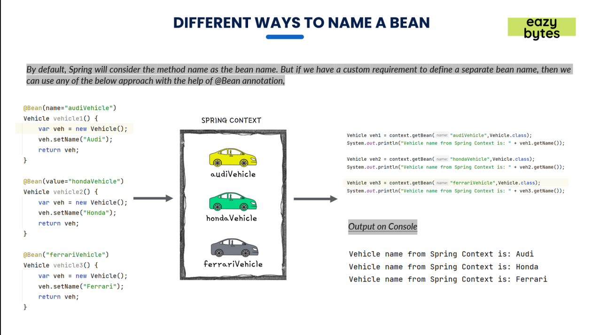

Build Tools:
Whenever we are trying to build web applications, we may use lot many libraries like when we try to
download the Java JDK, JRE, we will only get the libraries or jars related to core Java.
But think like you are trying to build a web application which leverages Spring framework, servlets
Hibernate framework or any other framework in this kind of scenarios.
Without a build tool like MAVEN, you as a developer need to download all the jars of the libraries
that you are going to use and configure them manually inside the classpath of your web application.
And this is the most tedious and cumbersome process that developers they used to follow before MAVEN,
but with the help of Maven and Gradle, you don't have to do all that manual job.
You just define what libraries you want to use inside your web application with the help of a configuration
file called Pom.xml.

Once you define all the libraries details inside the Pom.xml, the MAVEN is going to do all the magic
for you.

> > It is going to download all the libraries from the centralized repository inside the web, and the same
> > will be configured inside your local system.

> > And one more beauty of the Maven is you may end up using the same library in multiple projects inside
> > your local system or inside a server where you are trying to deploy your web application.
> > In such scenarios, MAVEN is going to leverage the existing jars that are downloaded instead of Redownloading
> > again and again.

> > And apart from these advantages, we also have one more great advantage, which is if you give your
> > web application that is build based upon MAVEN to your friend, you don't have to share all the jars,
> > you just share the web application which has pom.xml inside it.

> > And if your friend also has MAVEN installed inside his or her system, the jars will be downloaded into
> > his system automatically with the help of internet.

> > And apart from downloading and configuring the library jars inside your web application, Maven also
> > is going to help you to compile your web application to perform unit testing inside your web application
> > to package your web application into a jar or a war.
> > So there are many advantages that we have with the Maven Build tool.
