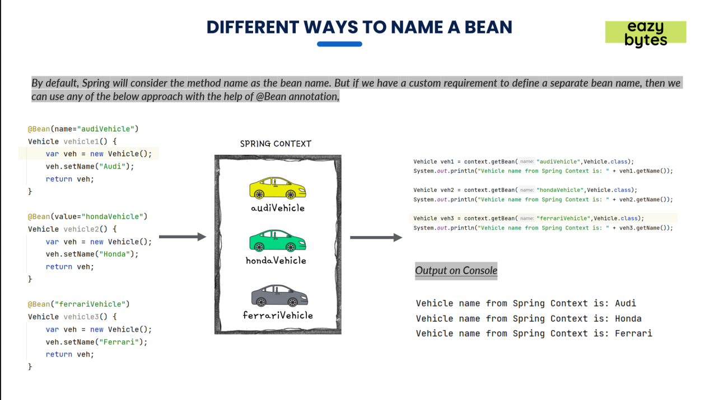

whatever is the name of your Java method, which you are using along with the @bean annotation.
The same name will be used as a bean name inside spring context.

Instead you want to have a control or you want to provide a custom or a different name to your bean based upon your requirements.
So in those scenarios, it's going to be pretty easy with the help of bean annotation.

so if you don't want to use the name of java method as your bean name then using

1. Using name parameter: @Bean(name=" here name of your choice for bean") //on top of method.
2. 2.Using value parameter: @Bean(value="here name of your choice for bean").
3. NO parameter: @Bean("here name of your choice for bean").

//In Example3.
