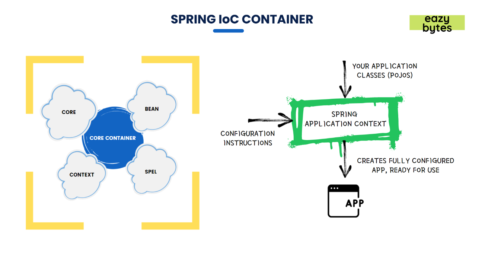

IOC container.

Like I mentioned before, spring IOC container, how it injects the dependencies between the multiple objects is with the help of dependency injection pattern.

If you look the representation that I'm showing on the screen, the spring IOC container leverages four important information.

The very 1)first one is 🫡core, all the "**_core libraries_**" available from the spring framework and the "**_core principles_**" that spring framework is adopted, like _inversion of control_ and _dependency injection_ post that spring IOC container also leverages the (2)🫡 **_context_**, which is a virtual memory location inside spring framework where all the configurations around

> how to create a bean.

> What are the dependencies that it has,

> what are the initial values that we want to instantiate?

So all those information available inside a memory location called context. So spring IOC container during the startup of the application will go ahead and look for the context information.

So based upon the configurations available inside the context location, it will convict all the applicable Java objects into the (3) 🫡beans and after converting the Java objects into the spring beans, it will also understand what are the dependencies between all these hundreds and thousands of beans are available inside a web application and during runtime, by using (4)🫡 **_spring expression language_**, it will try to inject the dependencies based upon the configurations that we mentioned inside the context location.

So don't worry while we discussing the actual practical examples around them then, definately it will make more sense to you, like how to define the configurations inside a context, how the beans will be created, how the beans dependencies can be created, and how the dependency injection pattern will be executed by the spring IOC container.

So all those details we can discuss again and it will make more sense when we are discussing the practical examples.

For now, please have a basic understanding about "spring IOC container that it uses all these four components" to maintain the objects inside a web application.

Like you can see on the right hand side of image

for the spring application context,

> if you provide the list of **💥application classes,** which are your pojo classes that you have written, all your business logic,

> and the other side, you will also provide the 💥**configuration instructions** that you have,
>
> like which classes you want to convert them to beans,
>
> What are the dependencies that a specific bean has or an object has inside your application?
>
> What are the initial values?
>
> So all those information you will provide using configurations instructions with the help of XML configurations or annotation configurations.

So by taking these 😀 two information(Application classes + Configuration Instructions), spring application context will prepare a fully configured application which is ready for use inside a 🎊production environment🎊.

So with this, I'm assuming you have some good understanding on what is spring IOC container, so don't worry if you have any further questions.

**I'm sure while we are discussing the coding examples, all your questions will be clarified.**

//////////////////////////////////////////////////////////////////////////////////////////////////////////////////////////

Question 1:Which of the following statements regarding Spring framework is correct ?

a)Whether you're building secure, reactive, cloud-based microservices for the web, or complex streaming data flows for the enterprise, Spring has the projects/tools to help. 👍

b)Spring is a commercial framework and paid users only can use it.

Question 2:When Oracle stopped the evolution of _Java EE 8_ and the community took over its maintenance, it has been renamed as ?

answer: jakarta EE.

Question 3:What are the core principles of Spring framework ?

a)IOC

B)Dependency Injection

c) both 👍

Question 4:Which of the following is the advantage of Inversion of Control (IoC) & Dependency Injection ?

a)No configurations inside projects

b)code performance improvement

c)Loose coupling b/w the components 👍

Question 5:Which of the following statements defines Beans correctly inside Spring framework ?

a)Any normal POJO class that is instantiated, assembled, and otherwise managed by a spring Ioc container is called spring

bean .👍

b) any normal POJO class inside spring web application is called spring bean

c) any normal POJO class object created with the help of new() operator.

Question 6:Which of the following component of Spring core is responsible to instantiate the application classes and assemble the dependencies between the objects/beans ?

a) Spring context

b) Ioc Container 👍

c)SpEL

7. Which of the following implementations of Spring IoC container is more advanced & recommended to use in real projects?
   a)org.springframework.context.ApplicationContext 👍
   b)org.springframework.beans.factory.BeanFactory
